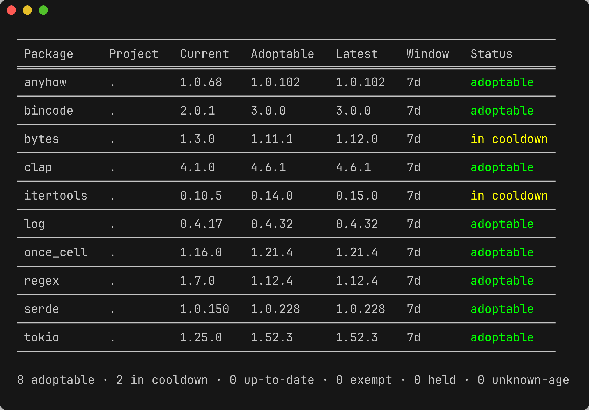

# cooldown

<p align="center">
  
</p>

A unified, language-agnostic **dependency-cooldown** CLI: refuse to adopt any dependency version
younger than a minimum release age, across tools, from one policy core.

Supply-chain attacks on package registries overwhelmingly follow a smash-and-grab pattern: a
malicious version is published and is detected and yanked within hours to a few days. A **cooldown**
(a.k.a. minimum release age) is the cheapest, highest-leverage defense — refuse to adopt any version
younger than _N_ days so the community's immune system runs before the code reaches your builds. The
risk surface is the **resolved lockfile** (direct _and_ transitive), so the gate reasons over the
whole graph.

Cooldown support today is fragmented per tool (uv `exclude-newer`, pnpm `minimumReleaseAge`,
yarn `npmMinimalAgeGate`, …), each with a different name, config surface, and UX. `cooldown`
collapses them into **one tool, one mental model**: it auto-detects the language(s) in a directory
and exposes the same subcommands, flags, config, and (pretty + JSON) output for all of them. The
cooldown verdict is computed in **one core evaluator**; native package managers are used only as
resolution/apply engines, never as the source of policy.

## Status

- **Go** — fully implemented (GOPROXY publish times, `x/mod` semver/pseudo-version semantics,
  `go`-driven resolution/apply).
- **Rust (cargo) / Python (uv)** — adapter crates landing against the same proven core contract.
- Default window is **7 days**; opting out is explicit (`--latest`).

## Install

```bash
cargo install --path crates/cooldown   # or: cargo build --release
```

## Usage

```bash
cooldown outdated      # what could update — "adoptable now" vs "in cooldown"
cooldown upgrade       # move to the newest version older than the cooldown, then re-lock
cooldown check         # CI gate: exit non-zero if anything resolved is younger than the cooldown
```

`cooldown upgrade --dry-run` previews the plan without touching the lock — only versions that have
already cleared their cooldown window are proposed.

The happy path is zero config. Raising the whole repo to 14 days is one line of `cooldown.toml`:

```toml
min-age = "14d"
```

### Subcommands

| Command            | What it does                                                                 |
| ------------------ | ---------------------------------------------------------------------------- |
| `outdated`         | What could update, split into adoptable-now vs in-cooldown.                  |
| `upgrade`          | Move direct deps to the newest version older than the cooldown; re-locks.    |
| `check`            | The CI gate over the resolved lockfile graph (fail-closed).                  |
| `baseline`         | Record currently-young deps as acknowledged so `check` adopts cleanly.       |
| `explain <pkg>`    | Why `<pkg>` has the window it has — every layer and rule that applied.       |
| `config`           | The fully-resolved config, with the origin of each value.                    |
| `init`             | Scaffold a documented starter `cooldown.toml` (refuses to clobber).          |
| `schema`           | Print the machine-readable JSON schema for `--json` output.                  |

### Exit codes

`check` is the CI gate, so non-zero is its contract:

| Code | Meaning                                                                              |
| ---- | ------------------------------------------------------------------------------------ |
| 0    | clean / nothing to do                                                                |
| 1    | policy violation (`check`) or an unmovable planned change (`upgrade --strict`)       |
| 2    | usage / config error (bad duration, unknown `--tool`, mutually-exclusive flags, …)   |
| 3    | no tool detected                                                                |
| 4    | stale/absent lock, registry unreachable, a tool failed, or unknown-age under a flag  |

## Configuration

`cooldown.toml` (repo) is the policy surface. One schema is used everywhere:

```toml
min-age = "14d"                 # the one knob most repos ever set (scalar form)
# per-kind windows (table form, instead of the scalar):
# min-age = { default = "14d", major = "30d", minor = "14d", patch = "7d" }

[tool.uv]                       # per tool (cargo / go / uv / …; aliases like python accepted)
min-age = "21d"

[registry."internal.acme.io"]   # per registry / index — our own registry is trusted
min-age = "0d"

[package."github.com/acme/*"]   # per package (glob) — most specific
min-age = "0d"

allow = ["acme/*"]              # exemption set (audited; shown in `explain`)
floor = "3d"                    # a hard minimum no nearer config can weaken
```

`latest = true` is sugar for `min-age = "0d"`; `freeze = "2026-06-01"` pins an absolute cutoff.
Durations accept `"7d"`, `"2 weeks"`, ISO-8601 `"P7D"`.

### Precedence — authority-first

Two orthogonal axes. **Layers** (low → high authority): built-in default → global config → native
manifest config → repo/project `cooldown.toml` cascade (nearer wins) → `--config` file → `COOLDOWN_*`
env → CLI flags. **Selectors** (most → least specific): `package` > `registry` > `project` > `tool`
> default.

Resolution is per field: `min-age` is **authority-first** (highest layer wins; within a layer the
most specific selector breaks the tie); `floor` is **max-clamped** across layers (only ratchets
stricter); `allow` is an **accumulated union** that can bypass a floor only when co-declared with it
(or via an audited `--latest`/`--allow`). `cooldown explain <pkg>` prints the field-by-field
derivation.

## Architecture

Ports-and-adapters (hexagonal): a pure policy core that does no concrete I/O, a
`Tool`/`PackageRegistry` port pair, per-tool adapters, shared registry plumbing,
presentation, and a CLI composition root. Dependencies point inward at the core.

```
crates/
  cooldown-core/      domain model · evaluate() · check_pin() · resolve() · ports · config   (no I/O)
  cooldown-registry/  shared HTTP client · on-disk cache (monotonic publish-time floor) · concurrency
  cooldown-render/    TTY tables + the JSON envelope + schema
  cooldown-go/        Go Tool + GOPROXY registry
  cooldown/           the binary: app use cases · clap · config discovery · wiring · dispatch
```

Adding a tool is one new crate implementing the ports, registered in one line — no change to
the core, render, the config schema, or any other adapter.

## Security model

- **Threat model:** the smash-and-grab window. The cooldown delays _adoption_; it is not a malware
  scanner and pairs with `govulncheck`/`cargo audit`/advisory feeds.
- **Risk surface is the resolved graph.** `check` evaluates direct + transitive by default; the
  floor applies to transitive too. `upgrade` applies one change at a time and, if a re-lock drags in
  a too-fresh non-acknowledged transitive, restores the lock snapshot and skips that change — a
  passing `upgrade` never leaves a lock a subsequent `check` would reject.
- **Cache hardening:** a cached publish time may never move _earlier_ on refresh (monotonic floor);
  a backdated upstream timestamp is rejected, not trusted.
- **Escape hatches are explicit and audited** (`--latest`/`--allow`/config `allow`, all in
  `explain`); a `floor` bounds config-level loosening.

## License

MIT OR Apache-2.0.
