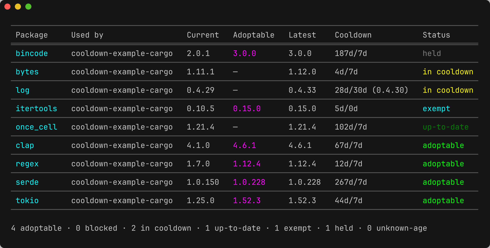

# cooldown

<p align="center">
  
</p>

<p align="center">
  <a href="https://romnn.github.io/cooldown/"><strong>Documentation</strong></a>
</p>

A unified, language-agnostic **dependency-cooldown** CLI: refuse to adopt any dependency version
younger than a minimum release age, across tools, from one policy core.

Supply-chain attacks on package registries overwhelmingly follow a smash-and-grab pattern: a
malicious version is published and is detected and yanked within hours to a few days. A **cooldown**
(a.k.a. minimum release age) is the cheapest, highest-leverage defense — refuse to adopt any version
younger than _N_ days so the community's immune system runs before the code reaches your builds. The
risk surface is the **resolved lockfile** (direct _and_ transitive), so the gate reasons over the
whole graph.

Cooldown support today is fragmented per tool (uv `exclude-newer`, pnpm `minimumReleaseAge`,
yarn `npmMinimalAgeGate`, …), each with a different name, config surface, and UX. `cooldown`
collapses them into **one tool, one mental model**: it auto-detects the language(s) in a directory
and exposes the same subcommands, flags, config, and (pretty + JSON) output for all of them. The
cooldown verdict is computed in **one core evaluator**; native package managers are used only as
resolution/apply engines, never as the source of policy.

## Status

- **Go** — fully implemented (GOPROXY publish times, `x/mod` semver/pseudo-version semantics,
  `go`-driven resolution/apply).
- **Rust** — `cargo` (crates.io). **Python** — `uv`, `pip` (`requirements.txt`), and `poetry`
  (all PyPI / PEP 440), plus `conda` and `pixi` (anaconda.org, mixed with PyPI).
- **JavaScript / TypeScript** — `npm`, `pnpm`, `yarn`, and `bun` (npm registry) plus `deno`
  (mixing `npm:` and `jsr:` dependencies).
- **Ruby** — `bundler` (rubygems.org). **Elixir** — `hex`/`mix` (hex.pm). **Java** — `maven`
  (`pom.xml`) and `gradle` (`gradle.lockfile`), both Maven Central. **Swift** — SwiftPM
  (`Package.resolved`, backed by GitHub Releases publish times).
- Every package manager is its own `--tool`; one generic adapter is specialised per lockfile
  format, and adapters mixing registries (deno, conda, pixi) route each dependency to its source.
- Default window is **7 days**; opting out is explicit (`--latest`).

## Install

```bash
brew install --cask romnn/tap/cooldown

# Or install from source
cargo install --locked cooldown
```

## Usage

```bash
cooldown outdated      # what could update — "adoptable now" vs "in cooldown"
cooldown upgrade       # move to the newest version older than the cooldown, then re-lock
cooldown check         # CI gate: exit non-zero if anything resolved is younger than the cooldown
cooldown fix           # remediate: downgrade too-fresh deps to a matured version (never upgrades)
```

`cooldown upgrade --dry-run` previews the plan without touching the lock — only versions that have
already cleared their cooldown window are proposed.

#### Fixing violations

When `check` goes red because a dependency is younger than its cooldown, you have three options:
**wait** for it to mature, **`baseline`** it (acknowledge and accept the risk), or **`fix`** it.
`fix` is the dual of `upgrade` — it downgrades each violating dependency to the newest version that
has *already* matured past the cooldown, so `check` passes while the protection holds. It never
moves a dependency forward, and it only touches deps that are actually in violation.

By default `fix` works on the **whole resolved graph**, the same surface `check` gates: a too-fresh
**transitive** dep is rolled back to the newest matured version the graph still allows, not just
direct deps. This is safe by construction — the graph floor *is* a version every requirer already
accepts, and a mature direct dep was built against versions from before the window anyway, so a
fresh transitive it didn't ask for is the riskier state. `--transitive` relaxes this, mirroring
`check`:

- `--transitive hide` — direct-only: ignore transitive deps entirely.
- `--transitive allow` — report too-fresh transitives but leave them in place; still fix direct deps.

A transitive the graph pins at the fresh version (no lower version satisfies its requirers) can't be
rolled back on its own — `fix` reports it so you can address the dep forcing it. Exact pins are left
in place with a warning unless `--downgrade-pinned`, and a violation with no older matured version to
fall back to is likewise reported (`baseline` it or wait) rather than downgraded.

#### Manifest constraints

By default `upgrade` moves the **lock** within your declared version constraint and leaves the
manifest alone, so a `^1.4` stays `^1.4` while the lock advances to the newest matured `1.x`. When
the target falls **outside** the constraint — most commonly a cross-major bump (`--major`) past a
caret range, or a capped Python range like `>=1,<2` — cooldown rewrites the one owning manifest
entry so the version can be adopted at all, then re-locks. Edits are format-preserving (comments,
key order, and spacing are kept) and, for a Cargo workspace, an inherited `dep = { workspace = true }`
is widened in the root `[workspace.dependencies]`.

Pass `--rewrite` to always rewrite the declared constraint to the adopted version, even for an
in-range move (so `^1.4` becomes `^1.5`). The lock-only default is honored where the tool can pin an
exact in-range version without editing the manifest: cargo (`update --precise`), uv
(`lock --upgrade-package`), and pnpm (`update --no-save`). npm, yarn, and bun have no such command,
and Go's `go.mod` *is* the version source, so those always rewrite the manifest regardless of mode.

The happy path is zero config. Raising the whole repo to 14 days is one line of `cooldown.toml`:

```toml
min-age = "14d"
```

### Subcommands

| Command            | What it does                                                                 |
| ------------------ | ---------------------------------------------------------------------------- |
| `outdated`         | What could update, split into adoptable-now vs in-cooldown.                  |
| `upgrade`          | Move the whole graph (direct + indirect) to the newest matured version; re-locks. |
| `fix`              | Downgrade too-fresh deps to a matured version to clear a `check` violation.  |
| `check`            | The CI gate over the resolved lockfile graph (fail-closed).                  |
| `baseline`         | Record currently-young deps as acknowledged so `check` adopts cleanly.       |
| `explain <pkg>`    | Why `<pkg>` has the window it has — every layer and rule that applied.       |
| `config`           | The fully-resolved config, with the origin of each value.                    |
| `init`             | Scaffold a documented starter `cooldown.toml` (refuses to clobber).          |
| `schema`           | Print the machine-readable JSON schema for `--json` output.                  |

### Exit codes

`check` is the CI gate, so non-zero is its contract:

| Code | Meaning                                                                              |
| ---- | ------------------------------------------------------------------------------------ |
| 0    | clean / nothing to do                                                                |
| 1    | policy violation (`check`) or an incomplete mutation under `upgrade`/`fix --strict`  |
| 2    | usage / config error (bad duration, unknown `--tool`, mutually-exclusive flags, …)   |
| 3    | no tool detected                                                                |
| 4    | stale/absent lock, registry unreachable, a tool failed, or unknown-age under a flag  |

## Configuration

`cooldown.toml` (repo) is the policy surface. One schema is used everywhere:

```toml
min-age = "14d"                 # the one knob most repos ever set (scalar form)
# per-kind windows (table form, instead of the scalar):
# min-age = { default = "14d", major = "30d", minor = "14d", patch = "7d" }

[tool.uv]                       # per tool (cargo/go/uv/pip/poetry/conda/pixi/npm/pnpm/yarn/bun/
                                #   deno/bundler/hex/maven/gradle/swift; aliases like python accepted)
min-age = "21d"

[registry."internal.acme.io"]   # per registry / index — our own registry is trusted
min-age = "0d"

[package."github.com/acme/*"]   # per package (glob) — most specific
min-age = "0d"

allow = ["acme/*"]              # exemption set (audited; shown in `explain`)
floor = "3d"                    # a hard minimum no nearer config can weaken
```

`latest = true` is sugar for `min-age = "0d"`; `freeze = "2026-06-01"` pins an absolute cutoff.
Durations accept `"7d"`, `"2 weeks"`, ISO-8601 `"P7D"`.

### Precedence — authority-first

Two orthogonal axes. **Layers** (low → high authority): built-in default → global config → native
manifest config → repo/project `cooldown.toml` cascade (nearer wins) → `--config` file → `COOLDOWN_*`
env → CLI flags. **Selectors** (most → least specific): `package` > `registry` > `project` > `tool`
> default.

Resolution is per field: `min-age` is **authority-first** (highest layer wins; within a layer the
most specific selector breaks the tie); `floor` is **max-clamped** across layers (only ratchets
stricter); `allow` is an **accumulated union** that can bypass a floor only when co-declared with it
(or via an audited `--latest`/`--allow`). `cooldown explain <pkg>` prints the field-by-field
derivation.

### Excluding folders and packages

Two independent knobs trim what a run looks at. Both live under the flag-default sections —
`[global]`, a `[<command>]` override, or `[tool.<name>]` for one ecosystem — and **concatenate**
across them (a prune set; order is irrelevant). Every pattern is compiled when the config is
loaded, so a bad glob is a config error (exit 2), not a surprise mid-scan.

```toml
[global]
exclude-folders = ["examples", "/build", "third_party/grammars"]
exclude-packages = ["internal-*"]

[outdated]
exclude-folders = ["fixtures"]      # adds to the global set, for `outdated` only

[tool.npm]
exclude-folders = ["e2e"]           # per-ecosystem folder excludes
exclude-packages = ["@scope/*"]     # package-name format differs per ecosystem
```

**`exclude-folders`** prunes directories from project detection (in addition to `.gitignore`), and
also drops a dependency whose declaring workspace members all sit under an excluded path — handy
when one root lockfile covers a whole monorepo. It uses the **same `.gitignore` semantics** the scan
already honors, so there is one model to learn:

| Pattern                  | Matches                                                              |
| ------------------------ | ------------------------------------------------------------------- |
| `target`                 | every `target/` directory, at **any depth**                         |
| `target/`                | identical — a trailing slash is allowed and ignored                 |
| `/build`                 | only the top-level `build/` (a leading slash anchors to the scan root) |
| `third_party/grammars`   | the root-relative path `third_party/grammars` (an interior slash anchors) |
| `**/snapshots`           | every `snapshots/` at any depth (explicit, same as the bare name)   |

**`exclude-packages`** drops a workspace member from reports when its **package name** matches a
glob — the same glob flavor as the `[package."…"]` policy selector. `*` is always a wildcard (no
registry permits `*` in a package name, so nothing needs escaping) and crosses `/`, so `@scope/*`
covers a whole npm scope and `serde_*` a crate family. Because names differ per ecosystem (`my-pkg`
vs `@scope/my-pkg`), reach for `[tool.<name>].exclude-packages` when a pattern is ecosystem-specific;
a `[global]` entry applies to every tool.

Both have a CLI form — `--exclude-folders <glob>` and `--exclude-packages <glob>` (repeatable) — that
**replaces** the `[global]`/`[<command>]` config lists for that run (per-tool `[tool.*]` excludes still
apply). CLI globs are validated the same way, so a malformed pattern is a config error.

## Architecture

Ports-and-adapters (hexagonal): a pure policy core that does no concrete I/O, a
`Tool`/`PackageRegistry` port pair, per-tool adapters, shared registry plumbing,
presentation, and a CLI composition root. Dependencies point inward at the core.

```
crates/
  cooldown-core/      domain model · evaluate() · check_pin() · resolve() · ports · config   (no I/O)
  cooldown-registry/  shared HTTP client · on-disk cache (monotonic publish-time floor) · concurrency
  cooldown-render/    TTY tables + the JSON envelope + schema
  cooldown-go/        Go Tool + GOPROXY registry
  cooldown-cargo/     Cargo Tool + crates.io registry
  cooldown-uv/        uv Tool + PyPI registry + PEP 440 version model (shared by pip/poetry/conda)
  cooldown-npm/       npm/pnpm/yarn/bun/deno Tools + npm & JSR registries (one adapter per lockfile)
  cooldown-pip/       pip + Poetry Tools (reuse the PyPI client)
  cooldown-conda/     conda + pixi Tools + anaconda.org registry (mixed with PyPI)
  cooldown-rubygems/  Bundler Tool + rubygems.org registry
  cooldown-hex/       Elixir/Hex Tool + hex.pm registry
  cooldown-maven/     Maven + Gradle Tools + Maven Central registry
  cooldown-swift/     SwiftPM Tool + GitHub Releases registry
  cooldown-adapter-util/  shared release classification + the package-manager CLI driver
  cooldown/           the binary: app use cases · clap · config discovery · wiring · dispatch
```

Adding a tool is one new crate implementing the ports, registered in one line — no change to
the core, render, the config schema, or any other adapter.

## Security model

- **Threat model:** the smash-and-grab window. The cooldown delays _adoption_; it is not a malware
  scanner and pairs with `govulncheck`/`cargo audit`/advisory feeds.
- **Risk surface is the resolved graph.** `check` evaluates direct + transitive by default; the
  floor applies to transitive too. For a too-fresh transitive you can't act on (a graph-held pin, or
  one you'd rather not block CI on), `check --transitive allow` keeps it visible but non-fatal, and
  `check --transitive hide` skips evaluating transitive deps entirely (a direct-only gate); the
  strict default stays opt-out, never opt-in. `upgrade` and `fix` apply one change at a time and, if a
  re-lock leaves a new too-fresh non-acknowledged dependency in the graph, restore the lock snapshot
  and skip that change — a passing mutation never leaves a lock a subsequent `check` would reject.
- **Cache hardening:** a cached publish time may never move _earlier_ on refresh (monotonic floor);
  a backdated upstream timestamp is rejected, not trusted.
- **Escape hatches are explicit and audited** (`--latest`/`--allow`/config `allow`, all in
  `explain`); a `floor` bounds config-level loosening.

## License

MIT OR Apache-2.0.
